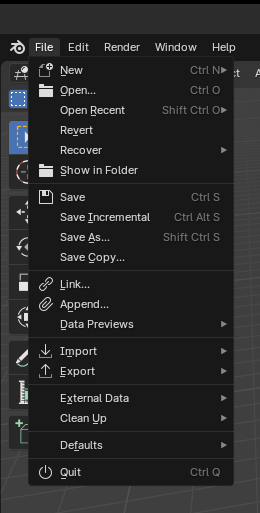

# Blender Addon : Open in Folder

Show current file in it's folder

This project was bootstrapped with [Blender Addon Template](git@github.com:kitchen-production/blender-addon-template.git).

## ⚙️ How it works

If you are working on a saved file, a new entry in File menu appear "Show in Folder".

## ⚙️ Commands

In the project directory, you can run:

### `make build`

Creates a zip file of your addon that you can install with the blender addon manager.

### `make clean`

Removes all unnecessary compiled python files.

## 📥 Installation

1. Download latest version from [Release](https://github.com/Ni-g-3l/blender-show-in-folder/releases)
2. Install it thnaks to the Blender Addon Manager

## 🔢 Versioning

We use [SemVer](http://semver.org/) for versioning. For the versions available, see the [tags on this repository](https://github.com/Ni-g-3l/blender-show-in-folder/tags).

## 🤹 Authors / Contributers / Attributions

* **Ni-g-3l** - *Main Developer* - [Github](https://github.com/Ni-g-3l/)

See also the list of [contributors](https://github.com/Ni-g-3l/blender-show-in-folder/contributors) who participated in this project.

## 📃 License

This project is licensed under the MIT License - see the [LICENSE.md](LICENSE) file for details.

## 👏 Acknowledgments

* **Billie Thompson** - *README & Contribution Templates* - [PurpleBooth](https://github.com/PurpleBooth)
* **Maxime Cots** - *Addon Template* - [PurpleBooth](https://github.com/Ni-g-3l)
