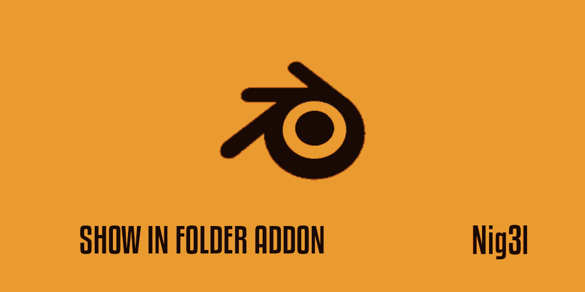

# Blender Addon : Open in Folder

Open current file in folder

This project was bootstrapped with [Blender Addon Template](git@github.com:kitchen-production/blender-addon-template.git).

## ⚙️ Commands

In the project directory, you can run:

### `make build`

Creates a zip file of your addon that you can install with the blender addon manager.

### `make clean`

Removes all unnecessary compiled python files.

### `make test`

Launches the unittest test runner.

### `make coverage`

Launches a tool for measuring code coverage of Python programs. It monitors your program, noting which parts of the code have been executed, then analyzes the source to identify code that could have been executed but was not.

## 📥 Installation

1. Download latest version from [Release](https://github.com/Nig3l/blender-open-in-folder-addon/releases)
2. Install it thnaks to the Blender Addon Manager

## 🔢 Versioning

We use [SemVer](http://semver.org/) for versioning. For the versions available, see the [tags on this repository](https://github.com/Nig3l/blender-open-in-folder-addon/tags).

## 🤹 Authors / Contributers / Attributions

* **Nig3l** - *Main Developer* - [Github](https://github.com/Nig3l/)

See also the list of [contributors](https://github.com/Nig3l/blender-open-in-folder-addon/contributors) who participated in this project.

## 📃 License

This project is licensed under the MIT License - see the [LICENSE.md](LICENSE) file for details.

## 👏 Acknowledgments

* **Billie Thompson** - *README & Contribution Templates* - [PurpleBooth](https://github.com/PurpleBooth)
* **Maxime Cots** - *Addon Template* - [PurpleBooth](https://github.com/Ni-g-3l)
